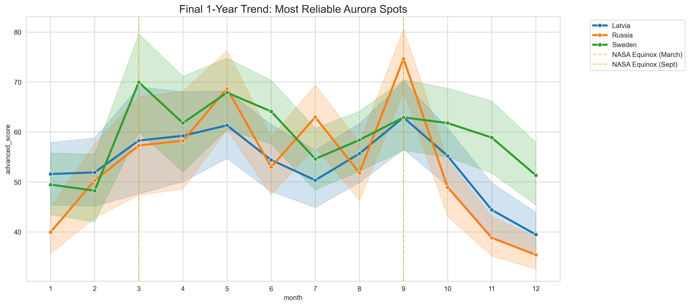

🌌 Aurora Visibility Scoring & Seasonal Pattern AnalysisProject ObjectiveThis project identifies scientifically reliable aurora observation windows by building a non-linear weighted visibility scoring system. Rather than asking "Where does aurora occur?", it focuses on identifying locations with the highest statistical probability of clear, dark, and stable atmospheric conditions.🛡️ The Journey to "df_gold": Data Integrity PipelineTo ensure analytical reliability, a rigorous filtering process was applied:The Iceland Paradox: I noticed Iceland had significant data gaps (>400 days) but contained a high-quality 649-day continuous segment.600-Day Threshold (The Gold Standard): Based on the Iceland segment, I initially applied a strict 600-day continuity filter to eliminate statistical noise.365-Day Robustness Check: Then I tested the model with a 1-year (365-day) threshold to ensure no geographic bias.Result: Both models yielded consistent rankings (Sweden > Latvia > Russia), proving the model's structural stability.🧪 Feature Engineering: The Advanced ScoreA composite Advanced Aurora Visibility Score (0–100) was engineered using domain-informed weights:$$Advanced\ Score = (Cloud_{penalty} \times 0.60) + (Darkness \times 0.15) + (Visibility \times 0.10) + (Duration_{log} \times 0.15)$$Cloud Obstruction: Weighted highest (60%) due to its absolute impact on visibility.NASA Validation: Seasonal peaks in March and September align perfectly with the Russell-McPherron Effect (Equinox peaks).📈 Key Insights & Visualizations 
 Figure 1: Final validated model showing peak visibility during equinoxes, confirmed by NASA data.💻 Tech Stack & DatabaseLanguage: Python (Pandas, Matplotlib, Seaborn)Database: SQLite (aurora_analysis.db)Validation: Processed data was persisted into SQL to ensure relational integrity and facilitate complex queries.🚀 How to RunClone the repository.Install dependencies: pip install -r requirements.txtOpen notebooks/aurora_analysis.ipynb to view the full pipeline.